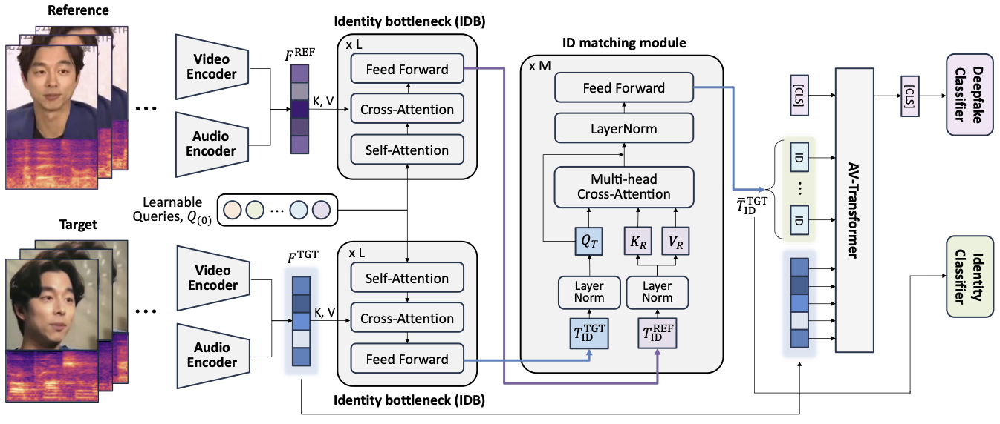

# Referee: Reference-aware Audiovisual Deepfake Detection
Hyemin Boo, Eunsang Lee, Jiyoung Lee

[Paper]

## Abstract



Since deepfakes generated by advanced generative models have rapidly posed serious threats, existing audiovisual deepfake detection approaches struggle to generalize to unseen forgeries.
We propose a novel reference-aware audiovisual deepfake detection method, called *Referee*.
Speaker-specific cues from only one-shot examples are leveraged to detect manipulations beyond spatiotemporal artifacts.
By matching and aligning identity-related queries from reference and target content into cross-modal features, *Referee* jointly reasons about audiovisual synchrony and identity consistency.
Extensive experiments on FakeAVCeleb, FaceForensics++, and KoDF demonstrate that *Referee* achieves state-of-the-art performance on cross-dataset and cross-language evaluation protocols.
Experimental results highlight the importance of cross-modal identity verification for future deepfake detection. 

## Requirements
### Environment
To train or evaluate Referee, you must first set up the environment:

```bash
conda create -n referee python=3.8.16
conda activate referee
pip install -r requirements.txt
```

### Dataset
For training and evaluation, the dataset should be prepared following the detailed format explained in [`pretrained/README.md`](./pretrained/README.md).

## Train
To train Referee, you can use the provided `train.sh`. Some training-specific settings, such as the number of epochs, starting epoch, and training dataset, are set directly in `train.sh`.

You can change most training parameters in the config file, `configs/pair_sync.yaml`. For example, you can adjust the learning rate, batch size, number of layers, etc.

Once you have set all parameters as desired, you can start training Referee using:

```bash
sh scripts/train.sh
```

## Evaluation
To evaluate Referee, you can use the provided `test.sh`. Some evaluation-specific settings, such as the model path and test dataset, are set directly in `test.sh`.

You can change most evaluation parameters in the config file, `configs/pair_sync.yaml`. For example, you can adjust the number of layers, the number of identity queries, etc.

Once you have set all parameters as desired, you can start evaluating Referee using:

```bash
sh scripts/test.sh
```

## Acknowledgement
This project heavily references the implementation of [SynchFormer](https://github.com/v-iashin/Synchformer). 

We thank the authors for making their code publicly available.
